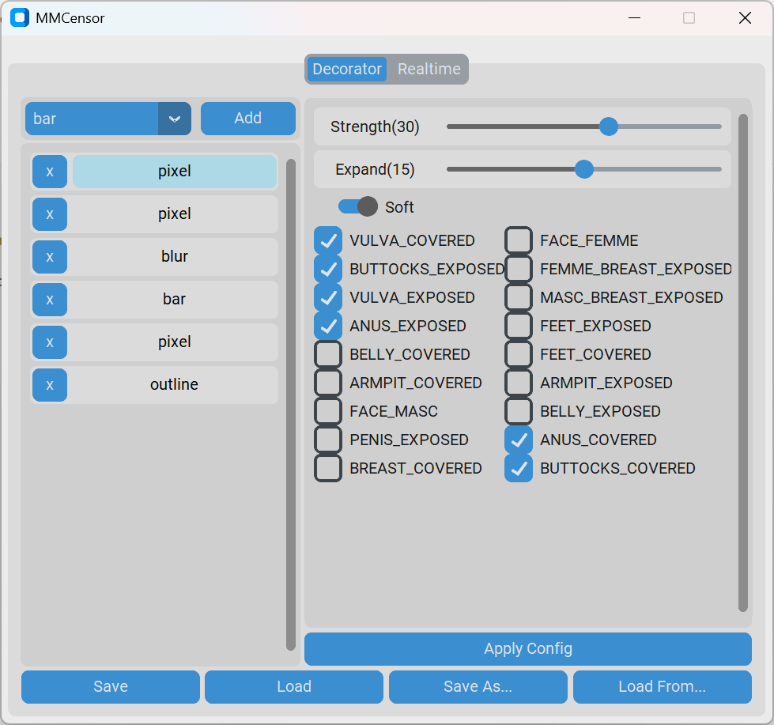

## MMCensor

A fork of [solarorb93/MMCensor](https://github.com/solarorb93/MMCensor) with several new features.

- GUI rewritten with [CustomTkinter](https://github.com/TomSchimansky/CustomTkinter).
- Added **support** for **NVIDIA 50 Series GPUs**.
- **Merged additional decoraters** from [HyperfocussedHedgehog/MMCensor](https://github.com/HyperfocussedHedgehog/MMCensor) and [CarlottaIsMe/MMCensor](https://github.com/CarlottaIsMe/MMCensor).

Read [**instructions.txt**](./instructions.txt) for more information.